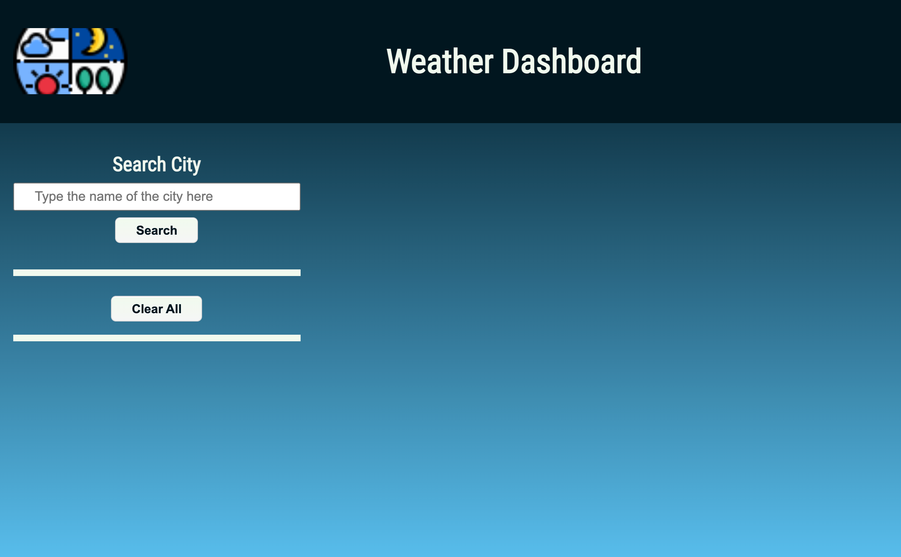
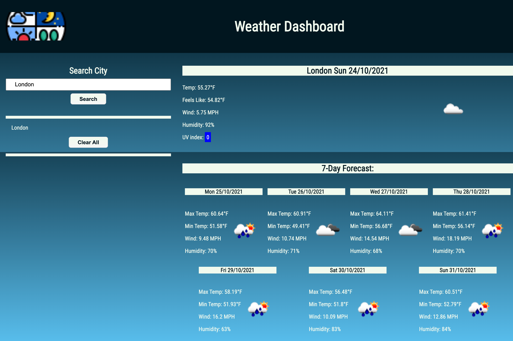
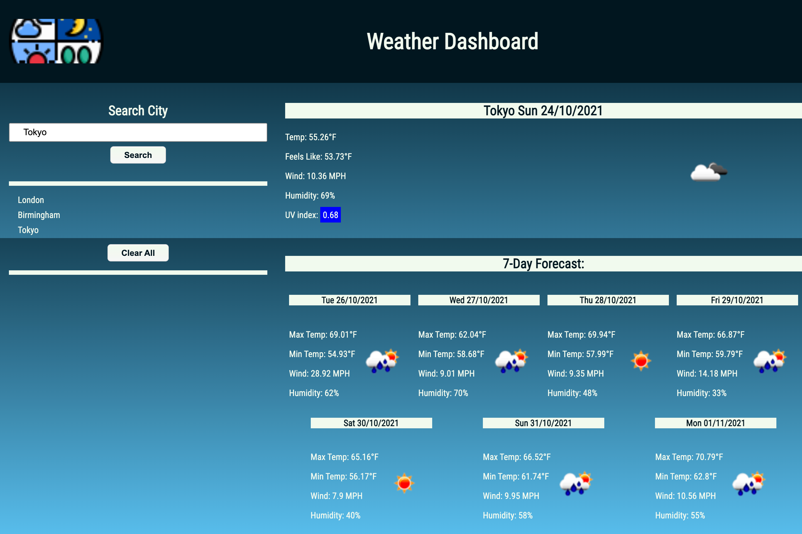
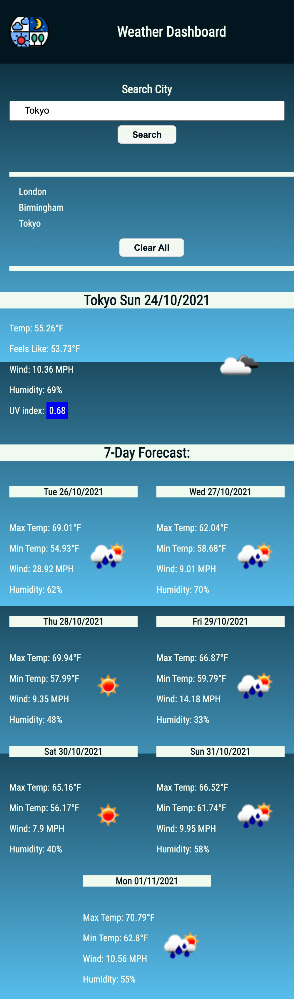

# weather-dashboard

A weather dashboard that will run in the browser and allow the user to find the weather conditions for any city he wants to. feature dynamically updated HTML and CSS.

# The Work day Planner

## Description

This is a flat and responsive weather dashboard application that runs in the browser and allows the user to research the weather conditions for any city around the world, just typing the city name. It will presents the current weather condition and for the next 7 days. Will be possible to check the temperature, wind speed, humidity and the UVI index. All designed and coded by Luiz Froes.

## User Story

AS A traveler
I WANT to see the weather outlook for multiple cities
SO THAT I can plan a trip accordingly.

GIVEN a weather dashboard with form inputs
WHEN I search for a city
THEN I am presented with current and future conditions for that city and that city is added to the search history.
WHEN I refresh the page
THEN I am presented with the current and future conditions for the last city I searched.
WHEN I view current weather conditions for that city
THEN I am presented with the city name, the date, an icon representation of weather conditions, the temperature, the humidity, the wind speed, and the UV index
WHEN I view the UV index
THEN I am presented with a color that indicates whether the conditions are favorable, moderate, severe or extremely severe.
WHEN I view future weather conditions for that city
THEN I am presented with a 5-day forecast that displays the date, an icon representation of weather conditions, the temperature, the wind speed, and the humidity.
WHEN I click on a city in the search history
THEN I am again presented with current and future conditions for that city.
WHEN I click on the clear all button
THEN all my search history is cleared.

## Deployed URL

You can view the GitHub pages deployed application [here](https://luizfroes.github.io/weather-dashboard/)

## Technologies Used

- HTML5
- Bootstrap
- CSS
- Font Awesome
- JavaScript
- JQuery

## Screenshots

### Final Website

